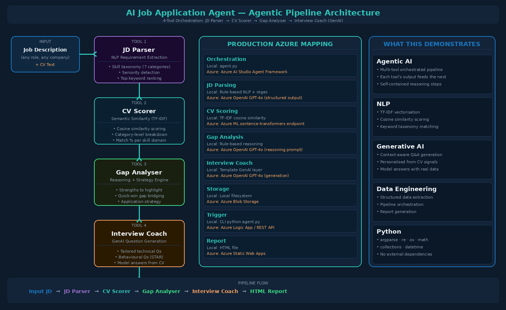

# 🤖 AI Job Application Agent

> **Agentic AI Portfolio Project**  
> A 4-tool orchestrated pipeline that analyses any job description against a CV, scores semantic similarity, identifies skill gaps, and generates tailored interview preparation using a GenAI layer — all fully offline, no API key required.



---

## 🎯 What It Does

Paste any job description and the agent runs a 4-step agentic pipeline:

| Step | Tool | Output |
|---|---|---|
| 1 | **JD Parser** | Extracts skills, requirements, seniority from raw JD text |
| 2 | **CV Scorer** | TF-IDF cosine similarity score — overall % match by category |
| 3 | **Gap Analyser** | Skill gaps, strengths to highlight, quick wins, application strategy |
| 4 | **Interview Coach** | 7–10 tailored interview questions + model answers (GenAI) |
| ✅ | **HTML Report** | Styled dashboard report saved to `output/` |

---

## 🏗️ Architecture

```
Job Description (text input)
        │
        ▼
┌─────────────────┐
│  Tool 1         │  ← Simulates: Azure OpenAI structured output prompt
│  JD Parser      │    Extracts: skills, seniority, requirements, keywords
└────────┬────────┘
         │
         ▼
┌─────────────────┐
│  Tool 2         │  ← Simulates: Azure ML endpoint (sentence-transformers)
│  CV Scorer      │    TF-IDF vectorisation + cosine similarity scoring
└────────┬────────┘    Category-level breakdown across 7 skill domains
         │
         ▼
┌─────────────────┐
│  Tool 3         │  ← Simulates: LLM reasoning layer (GPT-4o)
│  Gap Analyser   │    Identifies gaps, quick wins, application strategy
└────────┬────────┘
         │
         ▼
┌─────────────────┐
│  Tool 4         │  ← GenAI layer: generates personalised Q&A
│  Interview Coach│    Technical + behavioural + company-specific questions
└────────┬────────┘    with full model answers from CV context
         │
         ▼
   HTML Report Dashboard
   output/report_<role>.html
```

### Production Azure Mapping

| Component | Local Simulation | Azure Production |
|---|---|---|
| Orchestration | `agent.py` Python script | Azure AI Studio Agent Framework |
| JD Parsing | Rule-based NLP + regex | Azure OpenAI GPT-4o (structured output) |
| CV Scoring | TF-IDF cosine similarity | Azure ML (sentence-transformers endpoint) |
| Gap Analysis | Rule-based reasoning engine | Azure OpenAI GPT-4o (reasoning prompt) |
| Interview Coach | Template-based GenAI | Azure OpenAI GPT-4o (personalised generation) |
| Storage | Local filesystem | Azure Blob Storage |
| Trigger | CLI / `python agent.py` | Azure Logic App / REST API endpoint |
| Report | HTML file | Azure Static Web Apps |

---

## 🚀 How to Run

### Install dependencies
```bash
pip install -r requirements.txt
```

### Run with default JD (Accenture AI & Data Graduate)
```bash
python agent.py
```

### Run with your own JD (paste as text)
```bash
python agent.py --jd "Software Engineer at Google. Requirements: Python, Go, distributed systems..."
```

### Run with a JD from file
```bash
python agent.py --jd path/to/job_description.txt
```

The HTML report opens automatically and is saved to `output/`.

---

## 📊 Sample Output

```
🤖 AI Job Application Agent — Starting pipeline...

  [Tool 1/4] JD Parser        → Extracting requirements...
             Role: AI & Data Graduate Programme FY28
             Seniority: Graduate / Junior
             Skills found: 29 across 7 categories

  [Tool 2/4] CV Scorer        → Computing semantic similarity...
             Overall Score: 71.4%
             Grade: B — Strong Match
             Matched: 15 keywords
             Missing: 14 keywords

  [Tool 3/4] Gap Analyser     → Identifying strengths and gaps...
             Highlights: 4 strength areas
             Quick wins: 4 addressable gaps

  [Tool 4/4] Interview Coach  → Generating tailored Q&A (GenAI)...
             Generated 7 personalised interview questions

  ✅ All tools complete — generating report...
  📄 Report saved → output/report_AI_Data_Graduate.html
```

---

## 🗂️ Project Structure

```
ai-job-application-agent/
├── agent.py              # Main orchestrator — coordinates all 4 tools
├── tools/
│   ├── jd_parser.py      # Tool 1: NLP-based JD requirement extraction
│   ├── cv_scorer.py      # Tool 2: TF-IDF cosine similarity scoring
│   ├── gap_analyser.py   # Tool 3: Gap analysis + application strategy
│   └── interview_coach.py # Tool 4: GenAI interview Q&A generation
├── data/                 # Sample JDs for testing
├── output/               # Generated HTML reports
├── docs/                 # Architecture diagram
└── requirements.txt
```

---

## 💡 Key Technical Concepts

- **Agentic AI** — multi-tool orchestrated pipeline where each tool's output feeds the next
- **NLP / Semantic Similarity** — TF-IDF vectorisation with cosine similarity for CV-JD matching
- **Generative AI** — context-aware question and answer generation from CV + JD signals
- **Structured Extraction** — regex + taxonomy-based NLP for requirement parsing
- **Python** — pandas, re, collections, argparse, os

---

## 🔗 Related Projects

- [azure-property-analytics-ireland](https://github.com/alansha1/azure-property-analytics-ireland) — Medallion Architecture pipeline
- [AIRFARE-FORECASTING](https://github.com/alansha1/AIRFARE-FORECASTING) — 5-model ML comparison
- [ecom-sql-analytics](https://github.com/alansha1/ecom-sql-analytics) — Advanced SQL analytics

---

*Built by [Alan Sha](https://linkedin.com/in/alan-sha) · MSc Data Analytics, Dublin Business School*
